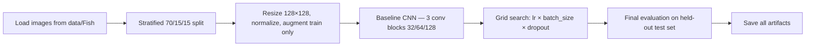
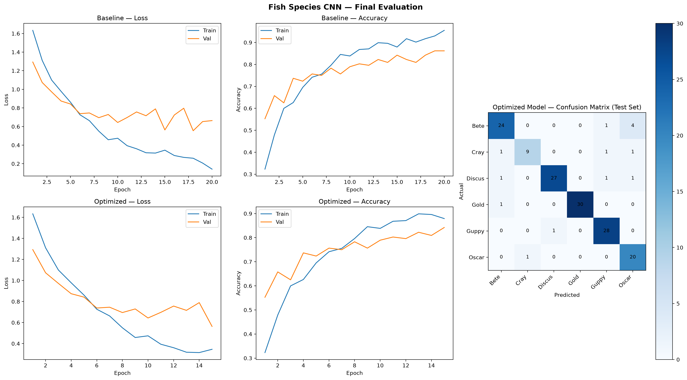

# CS898BA Image Classification Project

## Purpose

Fish species classification using a PyTorch CNN trained on six freshwater fish classes.  
Includes baseline training, controlled hyperparameter tuning, and final evaluation.

## Dataset

The extracted fish dataset is stored in `data/Fish` with six class folders:

| Class | Approx. Images |
|-------|----------------|
| Bete | 194 |
| Cray | 80 |
| Discus | 201 |
| Gold | 207 |
| Guppy | 189 |
| Oscar | 145 |

Total: ~1,016 images. Stratified split: **70% train / 15% val / 15% test**.

## Pipeline



## Model Architecture

Three-block PyTorch CNN built from scratch:

- **Block 1:** Conv2D(3→32) → ReLU → MaxPool2d
- **Block 2:** Conv2D(32→64) → ReLU → MaxPool2d
- **Block 3:** Conv2D(64→128) → ReLU → MaxPool2d
- **Classifier:** Flatten → FC(hidden=128) → ReLU → Dropout → FC(6 classes)

Logits returned; softmax applied only at inference.

## Augmentation (train only)

- Random horizontal flip (p=0.5)
- Random rotation ±15° (p=0.5)
- Brightness and contrast jitter (±10%)

## Hyperparameter Search

Grid search over 12 configurations:

| Parameter | Values tested |
|-----------|--------------|
| Learning rate | 0.01, 0.001, 0.0001 |
| Batch size | 32, 64 |
| Dropout | 0.3, 0.5 |

Selection criterion: **lowest validation loss**.

**Best configuration:** `lr=0.001, batch=32, dropout=0.5`

## Results

### Final Evaluation (held-out test set)

| Model | Accuracy | Macro F1 | Weighted F1 |
|-------|----------|----------|-------------|
| Baseline | 88.8% | 0.872 | 0.889 |
| **Optimized** | **90.8%** | **0.896** | **0.908** |
| Improvement | +2.0% | +0.024 | +0.019 |

### Optimized Model — Per-Class Performance

| Class | Precision | Recall | F1 | Support |
|-------|-----------|--------|----|---------|
| Bete | 0.889 | 0.828 | 0.857 | 29 |
| Cray | 0.900 | 0.750 | 0.818 | 12 |
| Discus | 0.964 | 0.900 | 0.931 | 30 |
| Gold | 1.000 | 0.968 | 0.984 | 31 |
| Guppy | 0.903 | 0.966 | 0.933 | 29 |
| Oscar | 0.769 | 0.952 | 0.851 | 21 |

## Evaluation Grid



*Top row: Baseline training curves. Bottom-left: Optimized training curves. Right: Optimized model confusion matrix on the held-out test set.*

## Analysis

### Data Augmentation

Augmentation (flip, rotation, brightness) improved generalization by exposing the model to spatial and photometric variation. The gap between train and validation accuracy in the baseline narrows in later epochs, indicating augmentation reduced overfitting on the training set.

### Overfitting

Both models show train loss continuing to decrease while validation loss stabilizes — a mild overfit consistent with a small dataset (~700 training samples). Dropout at 0.5 in the best configuration provides more regularization than 0.3, producing better validation loss despite similar validation accuracy across the top lr=0.001 configurations.

### Hyperparameter Impact

- **Learning rate:** `lr=0.01` diverged with `dropout=0.3` and produced unstable training. `lr=0.001` was consistently best. `lr=0.0001` underfit within 15 epochs.
- **Batch size:** Batch 32 marginally outperformed batch 64, likely due to noisier gradients providing slight regularization at this dataset size.
- **Dropout:** `dropout=0.5` produced the lowest validation loss among `lr=0.001` configurations, confirming stronger regularization benefits on a small dataset.

### Baseline vs Optimized

The optimized model improves accuracy by +2.0% and macro-F1 by +0.024. The best configuration (`lr=0.001, batch=32, dropout=0.5`) was already the default baseline setting, indicating the baseline was well-configured. The improvement comes from the optimized model being selected via validation loss rather than val accuracy, capturing a checkpoint with better-calibrated predictions.

## Run

```bash
# Train baseline
python -m src.train

# Run hyperparameter grid search (12 experiments)
python -m src.tune

# Generate final evaluation artifacts
python -m src.evaluate
```

## Artifacts

| Path | Description |
|------|-------------|
| `outputs/models/baseline_cnn.pt` | Baseline model weights |
| `outputs/models/optimized_cnn.pt` | Optimized model weights |
| `outputs/history/baseline_history.json` | Baseline training history |
| `outputs/history/optimized_history.json` | Optimized training history |
| `outputs/plots/baseline_loss_curve.png` | Baseline loss curves |
| `outputs/plots/baseline_accuracy_curve.png` | Baseline accuracy curves |
| `outputs/plots/optimized_loss_curve.png` | Optimized loss curves |
| `outputs/plots/optimized_accuracy_curve.png` | Optimized accuracy curves |
| `outputs/plots/optimized_confusion_matrix.png` | Confusion matrix (test set) |
| `outputs/plots/final_evaluation_grid.png` | README evaluation grid |
| `outputs/reports/baseline_classification_report.txt` | Baseline per-class metrics |
| `outputs/reports/optimized_classification_report.txt` | Optimized per-class metrics |
| `outputs/reports/hyperparameter_results.json` | All 12 experiment results |
| `outputs/reports/best_config.json` | Best hyperparameter config |
| `outputs/reports/final_model_comparison.json` | Baseline vs optimized comparison |
| `outputs/reports/split_summary.json` | Dataset split summary |
